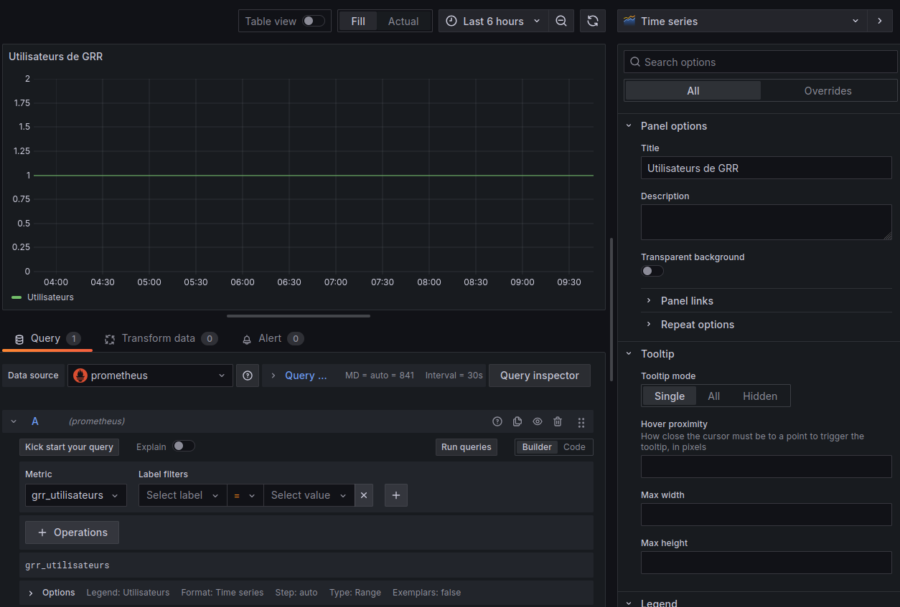

# TP Grafana

[TOC]

## Observer les metrics depuis Openshift

Openshift/OKD propose un menu permettant de consulter les données de monitoring (metrics) et d'en faire des graphiques. 
En mode *Developer*, rendez vous dans le menu Observe. Plusieurs onglets sont disponibles. Nous allons nous intéresser aux deux premiers : 
### Dashboard
Cet onglet propose une série de dashboard prédéfinis. Ils permettent d'avoir des informations sur les ressources (CPU, mémoire, réseau) consommées par votre projet actuel. 

>:bulb:
>En cliquant sur le bouton **inspect** d'un graphique puis **Show PromQL** vous pouvez voir la requête utilisée. Cela peut être utile pour créer vos propres requêtes !


### Metrics
Cet onglet donne plus de liberté et permet d'afficher un graphe d'une metric simple ou d'une requête plus complexe.
Vous avez accès à des metrics générales (CPU Usage, Memory Usage, etc.)
En sélectionnant le champ **Custom query**, vous pouvez interroger n'importe quelle metrics disponibles dans votre projet.

>:bulb:
>Le champ **Custom query** fait une auto-complétion des metrics que vous rentrez, vous pouvez par exemple taper "cpu" pour avoir l'ensemble des metrics qui contiennent le mot "cpu".

Pour tester, vous pouvez afficher le nombre d'utilisateurs de votre site GRR à l'aide de la metric `grr_utilisateurs`. Appuyer sur la touche **Entrer** pour valider.


## Visualisation des metrics depuis Grafana

Grace à l'opérateur Grafana installé sur le cluster Openshift, nous pouvons facilement créer une instance Grafana dans notre projet : 
- en mode *Developer*, cliquez sur le bouton **+Add** dans le menu à gauche
- dans le *Developer Catalog*, choisissez **All services**
- dans le champ *recherche*, tapez `Grafana` et sélectionnez la tuile *Grafana*
- cliquez sur **Create**
- sélectionnez la vue **YAML** pour voir la configuration par défaut de l'instance Grafana qui sera créée. Notez le login/password
- complétez le yaml pour ajouter les infos sur la route (modifier la valeur de la clé *host*, ici 'test-anf', par le nom de votre projet) : 

  ```yaml
  apiVersion: grafana.integreatly.org/v1beta1
  kind: Grafana
  metadata:
    labels:
      dashboards: grafana-a
      folders: grafana-a
    name: grafana-a
    namespace: test-anf
  spec:
    config:
      auth:
        disable_login_form: 'false'
      log:
        mode: console
      security:
        admin_password: start
        admin_user: root
    route:
      spec:
        host: grafana-test-anf.apps.anf.math.cnrs.fr
        path: /
        tls:
          insecureEdgeTerminationPolicy: Redirect
          termination: edge
        to:
          kind: Service
          name: grafana-a-service
          weight: 100
        wildcardPolicy: None
  ```
- cliquez sur **Create** pour lancer la création de Grafana

Au bout de quelques secondes, vous avez accès à votre instance Grafana à l'URL renseignée dans la partie *host* de la route.

Par défaut, la création d'une instance Grafana va créer une ressource Kubernetes de type *ServiceAccount*.
Un serviceAccount est comme un compte utilisateur interne à votre projet Openshift, il nous permettra d'interroger le Prometheus depuis Grafana.

### Configuration de la DataSource

Les DataSources permettent d'indiquer à Grafana où lire les metrics. 
Nous allons configurer comme datasource le Prometheus du cluster Openshift.

#### S'authentifier auprès du Prometheus

Pour interroger le Prometheus, il faut être authentifié. Il serait possible d'utiliser votre compte utilisateur mais il est préférable d'utiliser un compte machine (un serviceAccount) dédié à cela. L'installation de Grafana a créé un serviceAccount automatiquement. Vous pouvez le voir en vue *Administrator* :
- cliquer sur **Home**
- cliquez sur **Search**
- dans le menu *Resources*, tapez `ServiceAccount`
- vous devriez voir apparaître l'ensemble des serviceAccounts de votre projet, dont *grafana-a-sa*, le serviceAccount créé par l'instance Grafana.

Lors de la création de ce serviceAccount, un token a été généré automatiquement. C'est ce token que nous allons utiliser pour nous authentifier auprès du Prometheus. Si vous regardez le code YAML du serviceAccount *grafana-a-sa*, vous pourrez voir qu'il y a un bloc de ligne comme ci-dessous : 
```yaml
secrets:
  - name: grafana-a-sa-dockercfg-zc7n2
```
Ce bloc indique que le serviceAccount possède un *secret*. Allons voir ce secret en vue *Administrator* :
- cliquez sur **Workloads**
- cliquez sur **Secrets**
- vous devriez voir le secret en question, par exemple *grafana-a-sa-token-7xw4s*

Ce secret possède une clé *token* qui a pour valeur le token de notre serviceAccount. C'est ce token que nous allons utiliser pour l'authentification.

#### Donner les droits au serviceAccount

##### Avec l'interface web

Nous allons donner les droits d'interroger Prometheus au serviceAccount, pour cela en mode *Administrator* : 
- allez dans le menu **User Management**
- cliquez sur **RoleBindings**
- cliquez sur le bouton **Create binding**
- remplissez le formulaire avec les informations suivantes :
  - name: `grafana-a-sa-view`
  - namespace: votre projet
  - role: `view`
  - Subject: `ServiceAccount`
  - Subject namespace: votre projet
  - Subject name : le nom de votre serviceAccount qui doit être `grafana-a-sa`
- cliquez sur **Create**

##### A l'aide d'une ressource Kubernetes *RoleBinding*

Il est possible de donner ces droits à l'aide d'une ressource Kubernetes *RoleBinding* comme ci-dessous :  

```yaml
  kind: RoleBinding
  apiVersion: rbac.authorization.k8s.io/v1
  metadata:
    name: grafana-a-sa-view
    namespace: test-anf
  subjects:
    - kind: ServiceAccount
      name: grafana-a-sa
      namespace: test-anf
  roleRef:
    apiGroup: rbac.authorization.k8s.io
    kind: ClusterRole
    name: view
```

#### Création de la datasource 

Nous pouvons maintenant créer la datasource sur Grafana.
Depuis l'interface web de votre instance grafana, allez dans le menu **Connections** puis **Data sources** : 
- cliquez sur **Add data sources**
- sélectionnez le type **Prometheus* puis renseignez les valeurs ci-dessous :
  - Dans la partie *Connection*
    - Prometheus server URL : `https://thanos-querier.openshift-monitoring.svc.cluster.local:9092`
  - Dans la partie *Authentication*
    - Authentication methods: **No Authentication**
  - dans la partie *TLS settings*
    - cochez la case **Skip TLS certificate validation**
  - Dans la partie *HTTP headers*, ajouter un entête HTTP : 
    - Header: `Authorization`
    - Value: `Bearer <token serviceAccount>` en replacement `<token serviceAccount>` par le token du serviceAccount récupéré précédemment 
  - Dans la partie *Other*
    - Custom query parameters: `namespace=test-anf` (remplacez test-anf par le nom de votre projet)
    - HTTP method: **GET**
  
Cliquez sur **Save & test**. Votre instance Grafana est maintenant configurée pour interroger le Prometheus.

### Création d'un dashboard

Nous pouvons maintenant commencer à créer notre premier dashboard. 
Dans le menu de Grafana, cliquez sur **Dashboard**, puis **Create Dashboard**. 
Vous avez ici plusieurs choix : 
 - **Add visualization** : vous permet de créer votre dashboard entièrement à la main
 - **Add a library panel** : permet d'inclure des graphiques qui proviennent d'autres dashboard
 - **Import a dashboard** : permet d'importer un dashboard (au format JSON). De nombreux dashboards sont disponibles en téléchargement, par exemple sur le site https://grafana.com/grafana/dashboards/

Cliquez sur **Add visualization** pour créer votre dashboard. Après avoir sélectionné votre Datasource, vous arrivez sur la page vous permettant de créer votre premier graphique, appelé *Panel* dans Grafana.

- le cadre de droite permet de configurer le graphique. Vous pouvez choisir le type de graphe que vous voulez (time series, bar chart, etc.), donner un titre, etc.
- le cadre en bas vous permet de créer votre requête pour interroger des metrics. 
- le cadre juste au dessus est le résultat de votre requête.
Vous pouvez voir ci-dessous un exemple : 


Cliquez sur **Apply** pour créer le panel. 
Vous pouvez maintenant ajouter n'importe quel graphique que vous souhaitez afficher sur votre dashboard. 

### Sauvegarder le dashboard

Lorsque vous avez fini de créer le dashboard, il faut penser à le sauvegarder. Vous pouvez cliquer sur le bouton **Save dashboard** (la disquette) de Grafana mais cela ne suffira pas. Le pod Grafana qui a été créé ne possède pas de volume persistent et ne stocke rien de façon pérenne. Un redémarrage du pod entraînera une perte des modifications que vous avez réalisées pour ajouter votre datasource et créer votre dashboard. Il serait possible d'ajouter un volume persistant à notre Grafana pour conserver les modifications, mais il y a mieux !

Pour la suite du TP, nous allons exporter le dashboard au format JSON :  
- sur grafana, lorsque vous êtes sur votre dashboard, cliquez sur le bouton **Share** en haut à droite.
- allez dans l'onglet **Export**
- activer l'option *Export for sharing externally*. Cela permettra de rendre agnostique la datasource.
- cliquez sur **View JSON** ou **Save to file** pour enregistrer le JSON

Vous pouvez maintenant supprimer votre pod grafana. Il va se recréer automatiquement et vous pouvez voir que vous avez tout perdu ! 

### Création des ressources avec l'opérateur Grafana

Pour garder l'esprit GitOps, vous pouvez configurer vos *DataSource* et *Dashboard* grâce à des ressources Kubernetes fournies par l'opérateur Grafana. l’intérêt est de pouvoir mettre la définition de ces ressources (fichiers YAML) dans un dépôt git ! 
Vous avez à votre disposition deux CRDs (Custom Resource Definition) Kubernetes : GrafanaDashboard et GrafanaDatasource. 

#### CRD GrafanaDatasource

Le type de ressource Kubernetes *GrafanaDatasource* permet de créer un datasource pour Grafana. Pour créer cette ressource :
- en mode *Developer*, cliquez sur le bouton **+Add** dans le menu à gauche
- dans le *Developer Catalog*, choisissez **All services**
- dans le champ *recherche*, tapez `datasource` et sélectionnez la tuile **GrafanaDatasource**
- cliquez sur **Create**
- sélectionnez la vue **YAML* pour voir la configuration par défaut puis complétez le YAML comme ci-dessous.

```yaml
kind: GrafanaDatasource
apiVersion: grafana.integreatly.org/v1beta1
metadata:
  name: grafanadatasource-prometheus
  namespace: test-anf
spec:
  datasource:
    access: proxy
    isDefault: true
    jsonData:
      customQueryParameters: namespace=test-anf
      httpHeaderName1: Authorization
      httpMethod: GET
      timeInterval: 5s
      tlsSkipVerify: true
    secureJsonData:
      httpHeaderValue1: 'Bearer ${token}'
    name: prometheus
    type: prometheus
    url: 'https://thanos-querier.openshift-monitoring.svc.cluster.local:9092'
  instanceSelector:
    matchLabels:
      dashboards: grafana-a
  plugins:
    - name: grafana-clock-panel
      version: 1.3.0
  valuesFrom:
    - targetPath: secureJsonData.httpHeaderValue1
      valueFrom:
        secretKeyRef:
          key: token
          name: grafana-a-sa-token-7xw4s
```

#### CRD dashboard

Vous pouvez maintenant créer votre ressource Kubernetes *GrafanaDashboard* :
- en mode *Developer*, cliquez sur le bouton **+Ad** dans le menu à gauche
- dans le *Developer Catalog*, choisissez **All services**
- dans le champ *recherche*, tapez `dashboard` et sélectionnez la tuile **GrafanaDashboard**
- cliquez sur **Create**
- complétez les informations comme ci-dessous et copier le contenu du JSON de votre dashboard en tant que valeur de la clé *json* (attention à l'indentation !).


```yaml
apiVersion: grafana.integreatly.org/v1beta1
kind: GrafanaDashboard
metadata:
  name: grr-dashboard
  namespace: test-anf
  labels:
    app.kubernetes.io/instance: grafana
spec:
  datasources:
    - datasourceName: prometheus
      inputName: DS_PROMETHEUS
  instanceSelector:
    matchLabels:
      dashboards: grafana
  resyncPeriod: 5m
  json: |
    {
      "__inputs": [
        {
          "name": "DS_PROMETHEUS",
          "label": "prometheus",
          "description": "",
          "type": "datasource",
          "pluginId": "prometheus",
          "pluginName": "Prometheus"
        }
    [...]
```

Vous avez retrouvé votre dashboard Grafana ! 