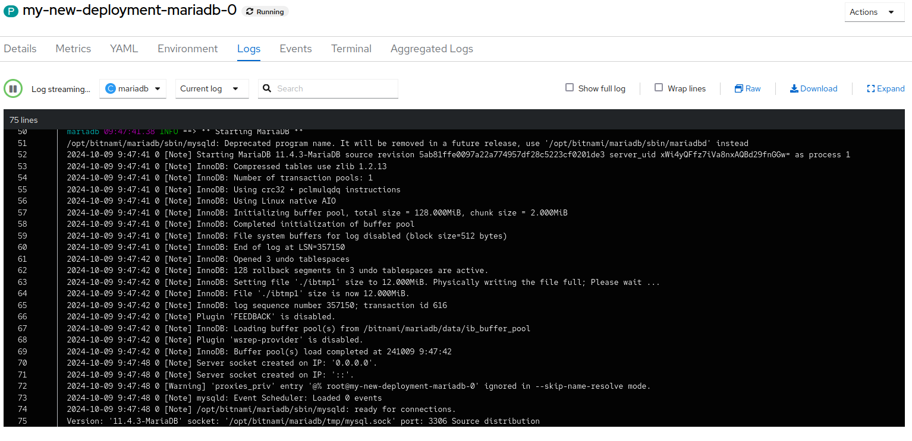

# TP Logs

[TOC]

## Consulter les logs depuis la ligne de commande

A l'aide du client **oc**, vous pouvez consulter les logs d'un pod avec la commande `oc logs ` : 

```
[salleman@syl:~]$ oc get pods
NAME                                   READY   STATUS    RESTARTS   AGE
grafana-a-deployment-896b74565-vmknm   1/1     Running   0          6h21m
my-new-deployment-grr-cf8bfd67-7kxcr   1/1     Running   0          31h
my-new-deployment-mariadb-0            1/1     Running   0          31h
```

```
[salleman@syl:~]$ oc logs my-new-deployment-mariadb-0  
```

## Consulter les logs depuis l'interface

Connectez vous à https://anf2024.math.cnrs.fr puis, en mode *Administrator* : 
- cliquez sur **Workloads**
- cliquez sur **Pods**
- choisissez le pod qui vous intéresse
- cliquez sur l'onglet **Logs**

Vous voyez les logs du pods actuel.



Le menu au dessus de la fenêtre des logs propose plusieurs actions, de gauche à droite : 
- sélection du container (un pod peut avoir plusieurs containers. Ce menu permet de sélectionner les logs du container qu'on souhaite observer)
- si un container/pod redémarre, vous pouvez voir les logs du précédent container/pod en sélectionnant **Previous logs** 


### Aggregated logs

L'onglet *Aggregated logs* offre une interface plus riche pour parcourir et chercher dans les logs. Vous pouvez par exemple filter par niveau de criticité des logs (critical, warning, info, etc.) et effectuer une recherche sur le contenu d'un log. 

