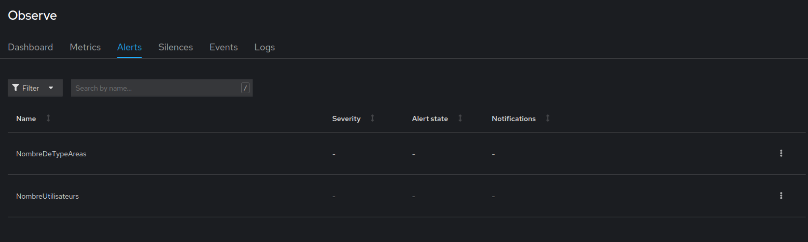
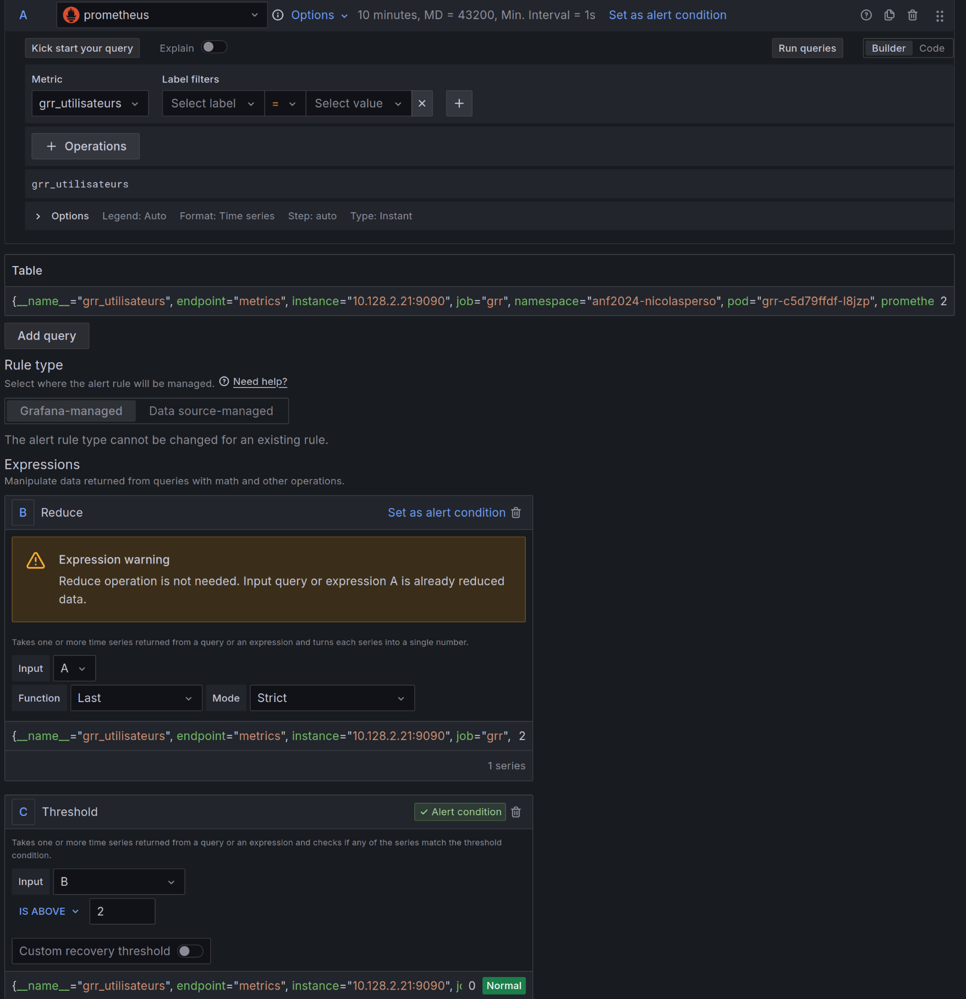

# Gestion des alertes

Avant d'attaquer cette partie, il faut suivi les instructions d'implémentation des dashboards grafana.
Nous allons nous appuyer sur les outils implémentés dans cette partie pour venir configurer les alertes.

Une fois en place, nous allons pouvoir nous appuyer sur les metrics de `grr` pour mettre en place des alertes selon des seuils que nous allons définir.

## I - sur interface web OKD

Avant toute chose, il est préférable de voir quelles sont les metrics disponibles.
Une bonne pratique est de voir directement quels sont les metrics proposé par les exporteurs.
Pour cela, nous pouvons aller consulter le service dédié qui est exposé sur le port 9090.

1. Faite une redirection de port pour consulter les metrics disponible sur l'application `grr`:

```bash
kubectl port-forward svc/grr 9090:9090
```

Une fois étudiées, nous allons mettre en place une prometheus rule pour créer une alerte visible depuis l'interface développeur de l'OKD.

2. Home -> Search -> PrometheusRules -> `Create PrometheusRule`

3. Appliquer le code suivant:

```yaml
apiVersion: monitoring.coreos.com/v1
kind: PrometheusRule
metadata:
  name: grr-alertes
  namespace: anf2024-nicolasperso
spec:
  groups:
    - name: grr_users
      rules:
        - alert: NombreUtilisateurs
          expr: grr_utilisateurs > 1
    - name: grr_type_area
      rules:
        - alert: NombreDeTypeAreas
          expr: grr_type_area > 3
```

Ici, nous faisons des alertes sur le nombre d'utilisateurs et le nombre de types areas.
Vous pouvez voir l'état des alertes dans la vue développeur -> Observe -> Alertes.

Tout va bien.
Maintenant, créons un utilisateur :
https://[VOTRE_NAMESPACE].apps.anf.math.cnrs.fr/admin/admin.php?p=admin_user

Et vous verrez l'alerte active :


## II - Sur grafana

La partie grafana a été installé et configuré depuis le TP metrics.
Nous allons pouvoir attaquer la partie alerting de grafana.

Cela se fait en plusieurs étapes :

1. Définition du contact point (canal de distribution)
2. Définition de la notification policy (relier les alertes aux cannaux de distribution)
3. Définition des alertes

### 1. Définition des contacts points

C'est ce qui définira vos canaux de distribution d'alertes.
En gros, comment on va envoyer les alertes.
Vous en avez des différents :

- email
- slack | mattermost
- SMS
- ...

On va en définir un par défaut et on recevra les alertes par mails :
Nommez le `grafana-contact-point-grr.yml`

```yaml
kind: GrafanaContactPoint
apiVersion: grafana.integreatly.org/v1beta1
metadata:
  labels:
    app.kubernetes.io/created-by: grafana-operator
    app.kubernetes.io/instance: grafanacontactpoint-sample
    app.kubernetes.io/managed-by: kustomize
    app.kubernetes.io/name: grafanacontactpoint
    app.kubernetes.io/part-of: grafana-operator
  name: default-contact-point
  namespace: [NAMESPACE]
spec:
  instanceSelector:
    matchLabels:
      dashboards: grafana-a
  name: grafanacontactpoint-default
  settings:
    addresses: "[VOTRE ADDRESS MAIL]"
    smarthost: "super.mathrice-anf.gricad.cloud.math.cnrs.fr:25"
    from: "grafana@anf2024.math.cnrs.fr"
  type: email
```

### 2. Définition notification policies

Les policies vont faire le lien entre les alertes et les contacts points.
Nommez le `grafana-notification-policies-grr.yml`

```yaml
kind: GrafanaNotificationPolicy
apiVersion: grafana.integreatly.org/v1beta1
metadata:
  name: grr-notification-policy
  namespace: [NAMESPACE]
spec:
  instanceSelector:
    matchLabels:
      dashboards: grafana-a 
  route:
    receiver: grafanacontactpoint-default
    group_by: ["grr"] #label à utiliser dans les règles d'alertes
    group_wait: "30s"
    repeat_interval: "1h"
```

Remarquer bien la valeur de l'attribut `group_by`, c'est le label qui sera à mettre dans les règles d'alertes afin de déterminer le canal dans lequel elle sera envoyée.

### 3. Ecritures des alertes

Avant de commencer à écrire les alertes, il faut créer un dossier dans lequel seront liées les règles.

Voici comment en créer via l'objet:
Nommez le `grafana-folder-grr.yml`

```yaml
apiVersion: grafana.integreatly.org/v1beta1
kind: GrafanaFolder
metadata:
  name: grr
spec:
  instanceSelector:
    matchLabels:
      dashboards: "grafana-a"
```

Pour la création des règles, la création du fichier peut-être complexe et très verbeux. 
Je vous recommande vivement de passer par l'interface graphique de grafana pour configurer vos alertes.

Ainsi, aller au chemin suivant :
Alerting -> Alert rules.

Et configurer une alerte pour la metric grr_utilisateur pour un seuil > 2.

1. Donner un nom à votre règle :

2. Définissez le seuil :

3. Définissez les critères d'évaluation de l'alerte :

Le dossier, étant déjà crée, est juste à sélectionner.
Pour le groupe d'évaluation, créer en un nouveau : `grafanaalertrulegroup-grr` pour une période de 2 minutes d'intervalle.

1. Attribuer la bonne notificaiton policy:

1. (optionnel) Donner une description ou un résumé de l'alerte :

1. save rule and exit

À la fin, vous pouvez extraire la règle que vous venez d'écrire et de créer un CRD `grafanaalertrulegroup`:
Nommez le `grafana-alertes-grr.yml`:

```yaml
kind: GrafanaAlertRuleGroup
apiVersion: grafana.integreatly.org/v1beta1
metadata:
  name: grafanaalertrulegroup-grr # le nom donné dans le groupe d'évaluation plus haut
  namespace: [VOTRE_NAMESPACE]
spec:
  folderRef: grr
  instanceSelector:
    matchLabels:
      dashboards: grafana-a
  interval: 2m # nombre de minutes donné dans le groupe d'évaluation
  rules:
    [COLLER_RÈGLE_ICI]
```

Vous devriez avoir une règle similaire à :

```yaml
kind: GrafanaAlertRuleGroup
apiVersion: grafana.integreatly.org/v1beta1
metadata:
  name: grafanaalertrulegroup-grr
  namespace: anf2024-nicolasperso
spec:
  folderRef: grr
  instanceSelector:
    matchLabels:
      dashboards: grafana-a
  interval: 2m
  rules:
    - uid: de0j1x6zswcn4f
      title: grr_utilisateurs
      condition: C
      data:
        - refId: A
          relativeTimeRange:
            from: 600
            to: 0
          datasourceUid: adefd758-3f7f-4230-b951-ce8589beff38
          model:
            disableTextWrap: false
            editorMode: builder
            expr: grr_utilisateurs
            fullMetaSearch: false
            includeNullMetadata: true
            instant: true
            intervalMs: 1000
            legendFormat: __auto
            maxDataPoints: 43200
            range: false
            refId: A
            useBackend: false
        - refId: B
          relativeTimeRange:
            from: 600
            to: 0
          datasourceUid: __expr__
          model:
            conditions:
                - evaluator:
                    params: []
                    type: gt
                  operator:
                    type: and
                  query:
                    params:
                        - B
                  reducer:
                    params: []
                    type: last
                  type: query
            datasource:
                type: __expr__
                uid: __expr__
            expression: A
            intervalMs: 1000
            maxDataPoints: 43200
            reducer: last
            refId: B
            type: reduce
        - refId: C
          relativeTimeRange:
            from: 600
            to: 0
          datasourceUid: __expr__
          model:
            conditions:
                - evaluator:
                    params:
                        - 2
                    type: gt
                  operator:
                    type: and
                  query:
                    params:
                        - C
                  reducer:
                    params: []
                    type: last
                  type: query
            datasource:
                type: __expr__
                uid: __expr__
            expression: B
            intervalMs: 1000
            maxDataPoints: 43200
            refId: C
            type: threshold
      noDataState: Alerting
      execErrState: Error
      for: 1m
      annotations:
        summary: Le nombre d'utilisateur enregistré est trop élevé
      labels:
        label: grr
      isPaused: false
```

Vous aurez alors un état d'alerte `normal`.

Revenez sur votre fichier `GrafanaAlertRuleGroup` et modifier le paramètre de 2 à 1 :
Donc de:

```yaml
conditions:
  - evaluator:
    params:
      - 2
```

à:

```yaml
conditions:
  - evaluator:
    params:
      - 1
```

L'état va évoluer de la manière suivante :

- À la fin de la période d'évaluation, il va passer en mode pending.
- Le seuil est dépassé, mais pour éviter les fausses alertes, l'état pending indique seulement qu'il y a un changement d'état.
- À la fin de la période de pending, l'état de se mettra en `firing` et vous recevrez une alerte email

### À vous

Essayer de créer une nouvelles alertes en vous appuyant sur une autre metric.

#### Bonus

Afficher les états des alertes dans un dashboard (https://grafana.com/docs/grafana/latest/panels-visualizations/visualizations/alert-list/)